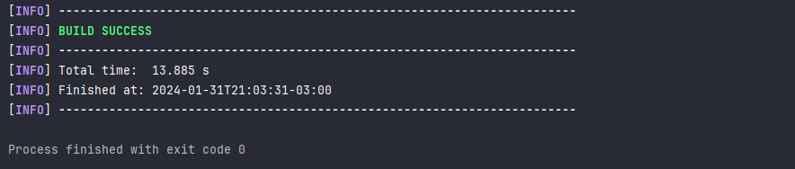
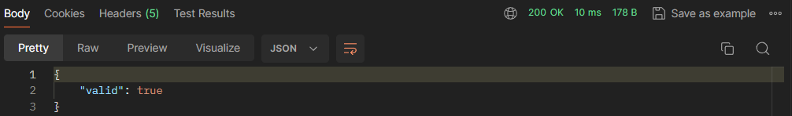

<h1 align="center"> API Validacao de Senhas </h1> <br>

## Sumario

- [Sobre o Projeto](#sobre-o-projeto)
- [API](#api)
- [Requisitos](#requisitos)
- [Arquitetura da aplicacação](#arquitetura-da-aplicação)
- [Observability](#observability)
- [Executando a aplicação](#executando-a-aplicação)
- [Segurança](#segurança)
- [Documentação](#documentação)
- [Docker](#docker)
- [Testes Unitários e de Integração](#testes-unitários-e-de-integração)
- [Contato](#contato)

## [Sobre o Projeto](#sobre-o-projeto)


Esta API tem o objetivo de validar uma senha no formato string e retornar um booleano. Ela retorna verdadeiro quando
atender todos os requisitos e falso quando não atender.

Requisitos:

- Ter nove ou mais caracteres
- Ter ao menos 1 dígito
- Ter ao menos 1 letra minúscula
- Ter menos 1 letra maiúscula
- Não ter espaços em branco
- Ter menos 1 caractere especial
    - São considerados válidos os caracteres especias !@#$%^&*()-+

## [API](#api)

* Endpoint HTTP:
    - **POST** ``/v1/senha/validar_senha`` Valida se senha atende os requisitos retornando no formato json ``true`` em caso positivo e ``false`` caso negativo.
    - Tanto em caso positivo quando negativo, a aplicação irá responder com o HTTP Status Code ```200 OK```.

| Parâmetro | Tipo parâmetro | Tipo dado   | Obrigatório | Descrição                           |
|-----------|----------------|-------------|-------------|-------------------------------------|
| Senha     | RequestBody    | Senha.class | Sim         | Classe com a a senha a ser validada |

## [Requisitos](#requisitos)

* Java 17 ou superior
* Maven
* [Postman](https://www.postman.com/) ou [Insomnia](https://insomnia.rest/products/insomnia) para executar testes
* __IMPORTANTE__: Para executar em ambiente corporativo, é necessários configurar o ``settings.xml`` para baixar as
  bibliotecas do Artifactory

## [Arquitetura da aplicação](#arquitetura-da-aplicação)


## [Observability](#observability)

Utiliza a biblioteca ``micrometer-registry-prometheus``
expondo no endpoint``http://localhost:8080/actuator/prometheus`` as métricas de saúde, da JVM e do Prometheus, tais 
métricas podem posteriormente serem capturadas e utilizadas pelo [Grafana](https://grafana.com/) para criação de
dashboards.
Tais configurações estão definidas no arquivo ``application.yml``. 


A aplicação utiliza da implementação da biblioteca ``Slf4`` para logar os princiais eventos.

```java
log.info("Iniciando validação da senha do correlationId "+correlationId);
log.info("A senha do correlationId "+correlationId+" possui erros");
```
Também expõe o status do health check no endpoint ``http://localhost:8080/actuator/health``.

## [Executando a aplicação](#executando-a-aplicação)

O primeiro passo é clonar o repositório do Github e entrar no diretório da aplicação:

```shell
git clone https://github.com/edsonrjunior/validacaoSenha.git
cd validacaoSenha
```

Após abrir na IDE, faça o build da aplicação executando o comando ``mvn clean install`` e verifique se o build finalizou
com sucesso.


<br>Após finalizado o build, inicie a aplicação com o comando ``mvn spring-boot:run`` e verifique se está utilizando
a porta 8080.


Em um aplicativo de testes de API (Postman ou Insomnia), crie uma resquisição do tipo POST no formato json conforme
abaixo. Utilize o endpoint ```http http://localhost:8080/v1/senha/validar_senha```. <br> A seguir clique em SEND.


Caso a string informada atenda os requitos, retornará ```{"valid": true}``` caso contrário ```{"valid": false}```,
ambas com HTTP Status Code ```200```.




Em caso de mais de 10 requisições em 1 minuto a aplicação responderá com o HTTP Status Code ```429 Too Many Requests```.


## [Segurança](#segurança)

Limitar a quantidade de requisições é um __mecanismo de segurança__ implementado com a biblioteca ```bucket4j-core```
para proteger contra ataques de
[__DDoS__](https://www.microsoft.com/pt-br/security/business/security-101/what-is-a-ddos-attack) e pode
ser facilmente parametrizado na classe ```HttpCallsLimit```.
<br><br>O primeiro parâmetro do método ```intervally``` informa quantas requisições podem ser realizadas e o segundo
parâmetro informa a duração que no caso é de 1 minuto. O primeiro parâmetro do método ```classic``` informa a
capacidade máxima de requisições que a API terá.

```java
    @Bean
public static Bucket bucketConfig(){
        var refill=Refill.intervally(10,Duration.ofMinutes(1));
        var limit=Bandwidth.classic(10,refill);

        return Bucket.builder()
        .addLimit(limit)
        .build();
```

## [Documentação](#documentação)

A aplicação utiliza o [Swagger](https://swagger.io/) que permite documentar de forma fácil e visual demonstrando
quais parâmetros necessários no request como também o response. Permite também executar testes de forma fácil.


## [Docker](#docker)

E possível também executar facilmente com o Docker

Crie a imagem docker com o comando abaixo

```shell 
docker build -t api/validacao_senha .
```

Em seguida crie o container para que a peça possa iniciar a execução

```shell 
docker run -d -p 8080:8080 --name valida_senha api/validacao_senha
```

Então verifique se o container foi criado corretanente.

```shell 
docker container ps
```


## [Testes Unitários e de Integração](#testes-unitários-e-de-integração)
A implementação utilza o framework JUnit 5 com as bibliotecas Mockito e WebMvc.
Possui 23 testes unitários com 100% das classes, 91.7% dos métodos e 92% das linhas cobertas.


## [Contato](#contato)
Em caso de dúvida ou sugestões entre em contato no canais de sua preferência

- [Email](mailto:edsonkjr@gmail.com)
- [LinkedIn](https://www.linkedin.com/in/edsonrjunior/)